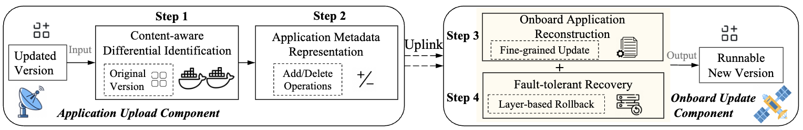

# SateLight: A Satellite Application Update Framework for Satellite Computing

 We release data and code used in this study to support reproducibility and future research.

 ## Evaluation Satellite Applications

 - The benchmark includes 10 representative satellite applications, labeled App1 to App10, located in the `Applications/` directory.
 - For each application, we provide the original code along with three updated versions reflecting 10%, 20%, and 50% code modifications.
    
    | AppID | Satellite Applications        |
    | ----- | ----------------------------- |
    | App1  | Object Detection              |
    | App2  | Core Network                  |
    | App3  | Image Encoding                |
    | App4  | Client Cache                  |
    | App5  | Multi-Stage Image Compression |
    | App6  | Ship Detection                |
    | App7  | Tracking Algorithm            |
    | App8  | Data Compression              |
    | App9  | Attitude Determination        |
    | App10 | Change Detection and Encoding |

 ## Satellite Application Update Framework Code

 SateLight implements an application update framework for satellite-ground systems through two core components, located in the `SateLightCode/` directory.
 - The Application Upload Component, deployed on the ground, is responsible for performing content-aware differential analysis between the updated and original containerized application versions (Step 1). It identifies semantic changes and encodes them into an expressive metadata representation (Step 2). 
    - The main implementation is provided in the file `write_diff.py` and `myers.py`.
 - The \textit{Onboard Update Component}, residing in the satellite system, receives the update payload and executes a fine-grained application reconstruction process to ensure update consistency and integrity (Step 3). In addition, it integrates a fault-tolerant recovery mechanism based on container image layering, enabling rapid rollback to a previous state in case of update failures (Step 4).
    - The main implementation is provided in the file `subsitute.py`.
- Other code
    - We provide scripts for generating application update variants across different programming languages. (`file_change_js.py`, `file_change_m.py`, `file_change.py`, `dir_change_js.py`, `dir_change_m.py`, and `dir_change.py`)
    - We provide a script to quantify the extent of code modifications between two versions of a satellite application. (`get_change_rate.py`)

## Real-world Satellite Deployment Code

- We provide the related code used to deploy a real-world satellite case, available in the `RealWorldDeployment/` directory.